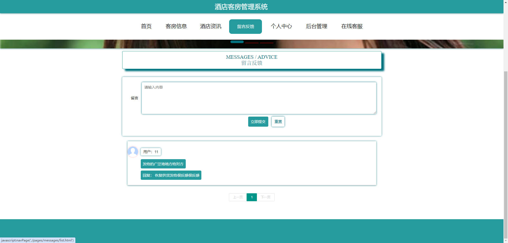
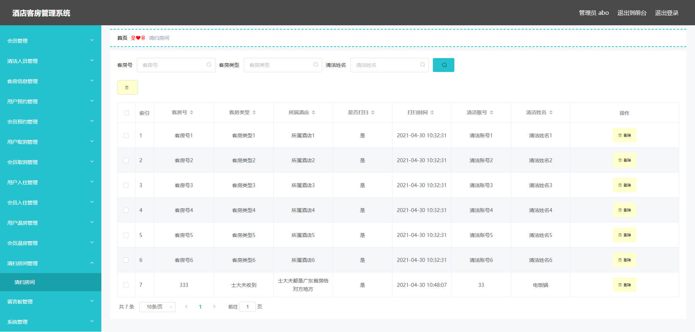
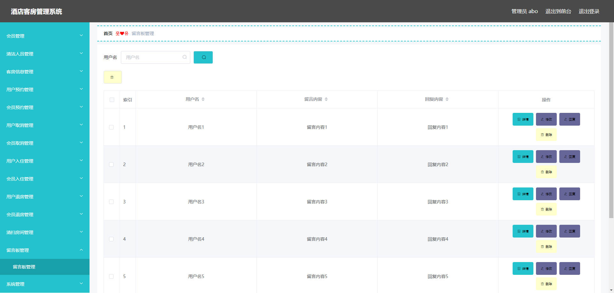
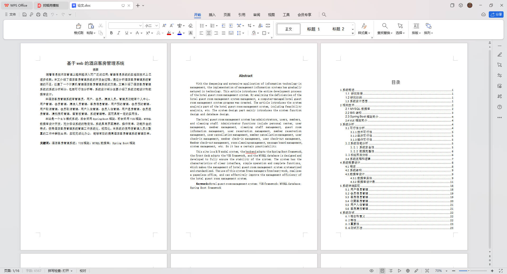

# 基于Springboot的酒店客房管理系统

## Springboot-0094


## 技术栈

Springboot mybatisplus vue mysql maven


## 数据库表(20张)


## 功能介绍

```properties
本酒店客房管理系统有管理员，用户，会员，清洁人员。

管理员功能有个人中心，用户管理，会员管理，清洁人员管理，客房信息管理，用户预约管理，会员预约管理，用户取消管理，会员取消管理，用户入住管理，会员入住管理，用户退房管理，会员退房管理，清扫房间管理，留言板管理，系统管理等。

用户功能有注册登录,客房信息查看和预订,酒店咨询,留言反馈和在线咨询,以及客房预订订单
```


## 图片

### 前台










## 访问路径

### 前台

```properties
http://localhost:8080/springboot6alf1/front/pages/login/login.html

账号 11
密码 11
```

### 后台

```properties
http://localhost:8080/springboot6alf1/admin/dist/index.html#/login

账号 abo
密码 abo
```


## 功能图


## 文档目录




## 打赏或交流


